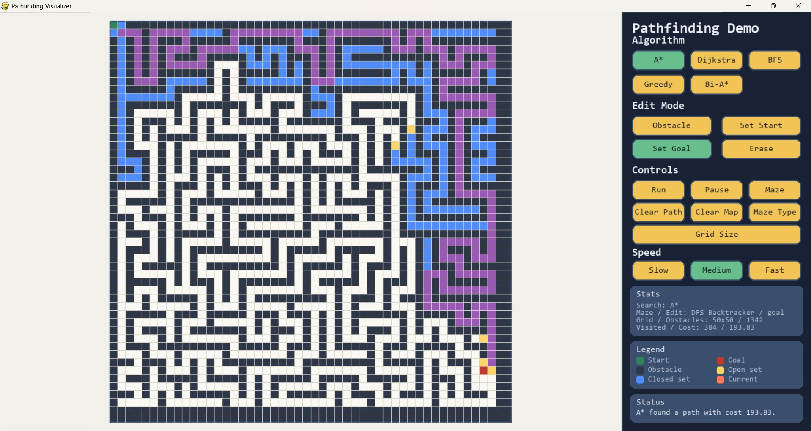

# Pathfinding Visualizer

English | [中文](#中文说明)



An interactive `pygame` desktop visualizer for grid-based path planning and maze generation. The map defaults to `100 x 100`, and users can resize it at runtime anywhere from `2 x 2` to `500 x 500`. Users can place the start point, goal point, and obstacles, choose a maze algorithm, generate a maze, then watch different pathfinding algorithms explore the grid and build the final path in real time.

## Features

- Runtime-adjustable grid size, default `100 x 100`, clamp range `2 x 2` to `500 x 500`
- Interactive editing for start, goal, obstacles, and erasing cells
- Dynamic visualization of:
  - A*
  - Dijkstra
  - BFS
  - Greedy Best-First Search
  - Bidirectional A*
- Animated maze generation with:
  - Recursive Division
  - DFS Backtracker
- Automatic scaling so large maps still fit inside the visible grid area
- Real-time display of explored nodes, current node, open set, closed set, and final path
- Adjustable animation speed
- Resizable window
- 8-direction movement with no corner cutting

## Requirements

- Python `3.13` recommended
- `pygame >= 2.5`

Install dependencies with:

```bash
python -m pip install -r requirements.txt
```

## Run

```bash
python main.py
```

Or run the packaged module directly:

```bash
python -m pathfinding_visualizer
```

## Controls

### Mouse

- Left click: apply the current edit mode
- Right click: erase the selected cell

### Edit Modes

- `Obstacle`: place obstacles
- `Set Start`: place the start point
- `Set Goal`: place the goal point
- `Erase`: clear a cell

### Keyboard Shortcuts

- `A`: switch to A*
- `D`: switch to Dijkstra
- `B`: switch to BFS
- `G`: switch to Greedy Best-First Search
- `I`: switch to Bidirectional A*
- `1`: obstacle mode
- `2`: set start mode
- `3`: set goal mode
- `4`: erase mode
- `Enter`: start search
- `R`: generate a maze
- `T`: switch maze algorithm
- `L`: change the grid size
- `Space`: pause or resume
- `C`: clear current path
- `M`: clear the map
- `Esc`: interrupt the current search

### Maze Controls

- `Maze`: generate a maze using the currently selected maze algorithm
- `Maze Type`: switch between Recursive Division and DFS Backtracker
- `Grid Size`: open an input dialog and resize the map

### Grid Size Input

- The dialog provides two separate input fields: one for width and one for height
- Each dimension is clamped independently to the nearest value in the range `2..500`
- Changing the grid size clears the current start point, goal point, obstacles, and visualization state

## Path Planning Rules

- 8-direction movement is enabled
- Straight moves cost `1`
- Diagonal moves cost `sqrt(2)`
- Diagonal corner cutting through blocked cells is not allowed

## Algorithm Notes

### A*

Uses both the traveled cost and the heuristic distance. It usually finds the optimal path with fewer explored nodes than Dijkstra.

### Dijkstra

Uses only the traveled cost. It guarantees an optimal path but often explores a larger area.

### BFS

Useful as a baseline search on an unweighted grid. It expands layer by layer.

### Greedy Best-First Search

Uses only the heuristic distance to the goal. It often appears very fast, but it does not guarantee the shortest path.

### Bidirectional A*

Searches from both the start and goal sides. It can reduce search effort on many maps.

## Maze Generation

### Recursive Division

The visualizer can generate an animated maze using Recursive Division. It repeatedly places horizontal or vertical walls with at least one opening so that the grid remains navigable.

### DFS Backtracker

The visualizer can also generate a maze using DFS Backtracker. It carves passages by walking through the grid depth-first and removing walls between visited maze cells, which tends to create long winding corridors.

Notes for the current implementation:

- Existing obstacles are replaced when a new maze is generated
- The current start and goal cells are preserved
- If needed, the generator opens a minimal connection near the preserved start and goal so pathfinding can still be demonstrated afterward

## Project Layout

```text
.
|-- assets/
|   `-- images/
|       `-- app-screenshot.jpg
|-- pathfinding_visualizer/
|   |-- __init__.py
|   |-- __main__.py
|   |-- app.py
|   |-- constants.py
|   `-- models.py
|-- main.py
|-- pyproject.toml
|-- README.md
`-- requirements.txt
```

- [main.py](main.py): thin compatibility entry point for `python main.py`
- [pathfinding_visualizer/app.py](pathfinding_visualizer/app.py): desktop app implementation and runtime logic
- [pathfinding_visualizer/constants.py](pathfinding_visualizer/constants.py): centralized UI, layout, and rendering constants
- [pathfinding_visualizer/models.py](pathfinding_visualizer/models.py): shared dataclasses and type aliases
- [pathfinding_visualizer/__main__.py](pathfinding_visualizer/__main__.py): module entry point for `python -m pathfinding_visualizer`
- [pyproject.toml](pyproject.toml): package metadata and console script definition
- [assets/images/app-screenshot.jpg](assets/images/app-screenshot.jpg): repository screenshot used in the README
- [requirements.txt](requirements.txt): dependency list for lightweight installs

## Notes

- The repository now uses a small package layout so the root stays focused on entrypoints, metadata, and documentation.
- The visible grid is scaled to fit the window, so very large maps remain usable without requiring a massive desktop resolution.

---

## 中文说明

这是一个基于 `pygame` 的交互式桌面路径规划与迷宫生成演示程序。地图默认是 `100 x 100` 网格，并且支持在运行时修改到 `2 x 2` 到 `500 x 500` 的范围。用户可以手动设置起点、终点和障碍物，也可以选择迷宫算法后自动生成迷宫，并动态查看不同路径规划算法的搜索过程与最终路径。

### 功能特点

- 支持运行时修改地图尺寸，默认 `100 x 100`，范围自动夹紧到 `2 x 2` 到 `500 x 500`
- 支持交互设置起点、终点、障碍物和擦除格子
- 支持以下算法的动态演示：
  - A*
  - Dijkstra
  - BFS
  - Greedy Best-First Search
  - Bidirectional A*
- 支持以下迷宫生成动画：
  - `Recursive Division`
  - `DFS Backtracker`
- 大地图会自动缩放到可视区域内显示
- 支持显示开放集、关闭集、当前扩展节点和最终路径
- 支持调节动画速度
- 支持窗口缩放
- 支持 8 方向移动，且禁止穿角

### 运行环境

- 推荐 Python `3.13`
- 依赖：`pygame >= 2.5`

安装依赖：

```bash
python -m pip install -r requirements.txt
```

运行程序：

```bash
python main.py
```

或者直接按模块运行：

```bash
python -m pathfinding_visualizer
```

### 快捷键

- `A`：切换到 A*
- `D`：切换到 Dijkstra
- `B`：切换到 BFS
- `G`：切换到 Greedy
- `I`：切换到 Bidirectional A*
- `1`：障碍物模式
- `2`：设置起点
- `3`：设置终点
- `4`：擦除模式
- `Enter`：开始搜索
- `R`：生成迷宫
- `T`：切换迷宫算法
- `L`：修改地图尺寸
- `Space`：暂停或继续
- `C`：清除当前路径
- `M`：清空地图
- `Esc`：中断当前搜索

### 迷宫相关操作

- `Maze` 按钮：按当前选中的迷宫算法生成迷宫
- `Maze Type` 按钮：在 `Recursive Division` 和 `DFS Backtracker` 之间切换
- `Grid Size` 按钮：打开输入框并修改地图尺寸

### 地图尺寸输入

- 弹窗中提供两个独立输入框，分别输入宽和高
- 宽和高会分别自动夹紧到 `2..500` 的最近边界
- 修改地图尺寸时，会清空当前起点、终点、障碍物和可视化状态

### 规则说明

- 允许 8 方向移动
- 直线移动代价为 `1`
- 对角线移动代价为 `sqrt(2)`
- 不允许从两个障碍物夹角处斜向穿过

### 迷宫生成

当前版本支持以下两种迷宫生成算法：

- `Recursive Division`：通过递归地添加横墙或竖墙，并保留通道口来生成迷宫
- `DFS Backtracker`：通过深度优先回溯不断打通单元之间的墙，生成偏长走廊风格的迷宫

实现特点：

- 生成新迷宫时会覆盖原有障碍物
- 已设置的起点和终点会被保留
- 如果生成结果影响起点或终点连通性，程序会补开最小连接区域，保证后续仍可用于路径规划演示

### 说明

- 当前项目已整理为更清晰的包结构，根目录主要保留入口、元数据和文档文件。
- 当窗口高度小于完整网格时，程序会安全裁剪可见区域，而不会报错退出。

### 项目结构

```text
.
|-- assets/
|   `-- images/
|       `-- app-screenshot.jpg
|-- pathfinding_visualizer/
|   |-- __init__.py
|   |-- __main__.py
|   |-- app.py
|   |-- constants.py
|   `-- models.py
|-- main.py
|-- pyproject.toml
|-- README.md
`-- requirements.txt
```

- [main.py](main.py)：兼容 `python main.py` 的轻量入口
- [pathfinding_visualizer/app.py](pathfinding_visualizer/app.py)：程序主体、界面逻辑与算法实现
- [pathfinding_visualizer/constants.py](pathfinding_visualizer/constants.py)：集中管理尺寸、颜色与界面常量
- [pathfinding_visualizer/models.py](pathfinding_visualizer/models.py)：共享数据结构与类型定义
- [pathfinding_visualizer/__main__.py](pathfinding_visualizer/__main__.py)：支持 `python -m pathfinding_visualizer`
- [pyproject.toml](pyproject.toml)：项目元数据与命令行入口配置
- [assets/images/app-screenshot.jpg](assets/images/app-screenshot.jpg)：README 中使用的程序截图